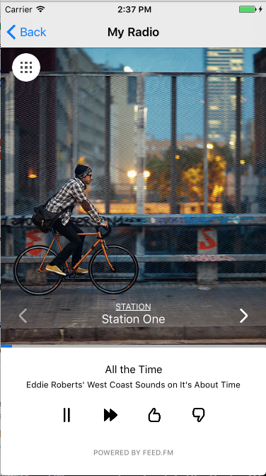
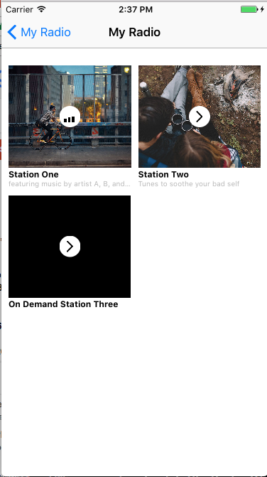

This is our second demo iOS app that makes use of the Feed Media SDK
to power a Pandora-style Internet-radio app. This app 
shows how you can easily display a scrolling grid of music
stations that the user can click to hear.

This player will retrieve the list of stations to display
from the server, along with station meta-data that
defines background images and descriptive text.

*If you want to add a music player to your app with minimal
coding, see instructions below.*




# Add the player to your app

To add this music player to your app with minimal coding, follow
the steps below (note: we'll assume you're using CocoaPods):

- Add the [FeedMedia](https://cocoapods.org/?q=FeedMedia),
[SDWebImage](https://cocoapods.org/?q=sdwebimage), and
[OAStackView](https://cocoapods.org/?q=oastackview) packages to
your Podfile and run `pod install` to add them to your project.

- Create a new `Player` group in your application.

- Open this repository's `iOS-RadioPlayer-2.xcworkspace` workspace,
  select all the files in the `iOS-RadioPlayer-2 > Player` group, and
  drag and drop those files into the `Player` group in your
  application. Make sure to check the 'Copy Items if Needed' option.
  and make sure the files are added to your apps primary target.

- Open your app's AppDelegate and add a call to set your
  client token and secret:

```objective-c
#import <FeedMedia/FeedMedia.h>

- (BOOL)application:(UIApplication *)application didFinishLaunchingWithOptions:(NSDictionary *)launchOptions {
  //...
  
  [FMAudioPlayer setClientToken:@"demo" secret:@"demo"];
  
  //...
}
```

- Somewhere in your app you should place a button that will open the 
FeedMedia music player. Set the default visibility of that button to
"hidden", so that if the app can't contact Feed.fm or the user is outside
of the United States, the radio player won't be visible. Then add this
code to the ViewController to make the button visible when music is
available:

```objective-c
#import <FeedMedia/FeedMedia.h>

- (void)viewDidLoad {
  // ... 
  
  FMAudioPlayer *player = [FMAudioPlayer sharedPlayer];
  [player whenAvailable:^{
    NSLog(@"music is available!");
        
    self.showPlayerButton.hidden = false;

    // optionally turn on music crossfading
    player.crossfadeInEnabled = YES;
    player.secondsOfCrossfade = 6.0;
        
  } notAvailable:^{
    NSLog(@"music is not available, so button will stay hidden");
        
  }];
  
  // ...
}
```

- Finally, attach the following `Touch Up Inside` event
handler to a button in your app.

```objective-c
#import "FMPlayerViewController.h"
#import "FMResources.h"

- (IBAction) onPlayerButtonTouched {
  FMStationCollectionViewController *stationCollection = [FMResources createStationCollectionViewControllerWithTitle:@"My Radio"];
  [self.navigationController pushViewController:stationCollection animated:YES];
}
```

- That's it! Music and stations can be added and removed server side, 
so there's no more touching required. Run your app and groove out! 

